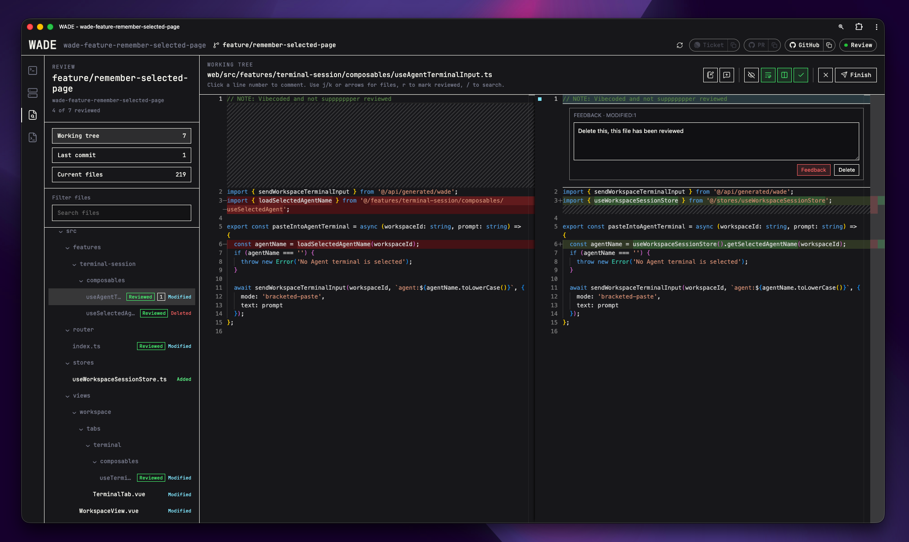

# WADE

> [!WARNING]
> WADE is under active development. Features, configuration and behaviour may
> change as the project evolves.



<p align="center"><sub>Review working-tree changes side by side and send inline feedback back to your coding agent.</sub></p>

WADE is a Web-based Agentic Development Environment. It gives coding agents a
local, project-focused browser workspace backed by real shells on your machine.

Instead of managing separate terminal windows, worktrees, diffs and repository
links, WADE keeps the tools for an agentic coding session together. Terminals
remain available when you navigate away and reconnect when you return.

WADE is local-first and keyboard driven. The server binds to your machine, your
shells stay local, and the main workflows are accessible without reaching for
the mouse.

## What you can do

- Find and open repositories across your configured workspace directories.
- Run a coding agent alongside miscellaneous and application server shells.
- Reconnect to terminals for as long as the WADE server is running.
- Review pull request, working tree and last-commit changes side by side.
- Leave line-level feedback or questions and send them directly to the agent.
- Create, open and remove Git worktrees from the command palette.
- Clone repositories visible to the GitHub CLI.
- Keep branch, pull request and issue context close to the workspace.
- Use a workspace scratchpad terminal without leaving the current screen.

## Install

WADE is currently installed from source. You will need:

- macOS or another Unix-like environment
- [Git](https://git-scm.com/)
- [mise](https://mise.jdx.dev/)
- at least one coding-agent CLI, such as [Pi](https://github.com/badlogic/pi-mono)
  or Claude Code
- optionally, an authenticated [GitHub CLI](https://cli.github.com/) for GitHub
  links, pull requests and repository cloning

```sh
git clone https://github.com/danielronalds/wade.git
cd wade
mise install
mise run build:install
```

The final command installs `wade` into Go's binary directory. If your shell
cannot find it, add `$(go env GOPATH)/bin` to your `PATH`.

## Get started

Start the WADE daemon:

```sh
wade start
```

Open <http://editor.localhost:8765>, then open Settings from `Ctrl + K` and set
the directories that contain your repositories. Press `Ctrl + P` to search for
a workspace.

WADE starts with `~/Personal` and `~/Work` as its workspace directories. Missing
directories are harmless and are skipped during discovery.

Use the CLI to manage the daemon:

```sh
wade status
wade stop
```

Running `wade start` again reports the existing daemon rather than starting a
second one. Logs and daemon state live under
`${XDG_STATE_HOME:-~/.local/state}/wade`.

To keep the server attached to your terminal, use:

```sh
wade start --foreground
```

A foreground server is unmanaged, so it does not appear in `wade status` and is
not stopped by `wade stop`.

## Keyboard shortcuts

| Shortcut             | Action                                               |
| -------------------- | ---------------------------------------------------- |
| `Ctrl + K`           | Open the command palette                             |
| `Ctrl + P`           | Open the workspace picker                            |
| `Ctrl + S`           | Open the active-workspace picker                     |
| `Ctrl + Alt + T`     | Toggle the scratchpad (`Ctrl + Option + T` on macOS) |
| `Ctrl + B`, then `1` | Switch to Terminal                                   |
| `Ctrl + B`, then `2` | Switch to Server                                     |
| `Ctrl + B`, then `3` | Switch to Review                                     |
| `Ctrl + B`, then `4` | Open the scratchpad                                  |
| `Ctrl + B`, then `o` | Focus the next terminal pane                         |
| `Ctrl + B`, then `z` | Zoom or restore the active Terminal pane             |

## Settings

Settings are available in the application or at
`~/.config/wade/config.json`. Run `wade config` to create and open the file in
`$EDITOR` (`nvim` is used when `$EDITOR` is unset).

A complete configuration looks like this:

```json
{
  "workspaceDirectories": ["~/Personal", "~/Work"],
  "shell": "",
  "agents": [
    { "name": "Pi", "command": "pi -c", "default": true },
    { "name": "Claude", "command": "claude", "default": false }
  ],
  "copyIgnoredFilesOnWorktreeCreation": false,
  "openWorktreesInNewTabs": false,
  "worktreeCopyExcludes": [],
  "themeAccentColor": "white",
  "linear": {
    "enabled": false,
    "workspace": ""
  }
}
```

Workspace directories may use `~` or absolute paths. Missing directories are
allowed and are skipped during discovery. Leave `shell` empty to use the
server's `$SHELL`. Exactly one configured agent must be the default.

Linear integration is optional. When enabled, `linear.workspace` must be the
workspace slug from `linear.app/<workspace>`, such as `signinsolutions`.

Safe changes can be applied without restarting through **Reload Settings** in
the command palette.

## Server address

The managed server uses <http://editor.localhost:8765> by default. Override the
address when starting it:

```sh
WADE_ADDR=127.0.0.1:9000 wade start
```

Development mode uses <http://editor-dev.localhost:8090>. WADE provides access
to real shells, so do not bind it to a public interface or expose it through a
public tunnel.

## Contributing

See [CONTRIBUTING.md](CONTRIBUTING.md) for local development, architecture,
testing and pull request guidance.

## Licence

WADE is available under the [MIT License](LICENSE).
