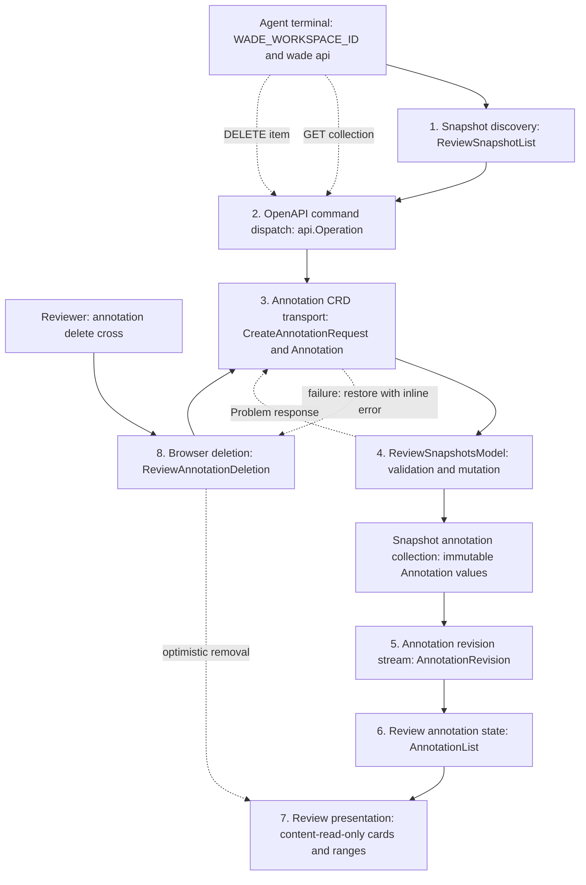

# Agent-authored Review Annotations Specification

## Problem Statement

WADE lets a person inspect a point-in-time review snapshot and leave inline feedback for a coding agent, but the communication is one-way. The agent cannot attach its own explanation or rationale to the exact lines being reviewed.

As a result, the reviewer must infer why a change exists from the code and terminal conversation. Useful context such as intent, trade-offs, risk areas, and non-obvious implementation decisions is separated from the diff where it is most useful.

Once an agent annotation is visible, the reviewer also needs to control whether it remains part of the review. Without a browser deletion action, an incorrect, stale, duplicated, or no-longer-useful annotation continues to occupy the diff until an agent removes it through the API. This interrupts the review workflow and leaves the reviewer unable to clean up the context in front of them.

The agent already runs inside a WADE-managed terminal with enough environment information to call WADE's local HTTP API. The complete capability is an immutable annotation resource that the agent can create, read, and delete beneath an existing review snapshot, a way for the Review tab to display those resources as they change, and a direct reviewer action that uses the same deletion contract.

## Solution

Add agent-authored annotations as child resources of a review snapshot.

An agent uses the existing `wade api` command to discover the workspace's in-memory review snapshots and create annotations against one exact snapshot file, comparison scope, side, and inclusive line range. The annotation endpoint supports create, read, and delete operations. It deliberately has no update operation. An agent revises a note by deleting it and creating a replacement.

The Review tab subscribes to annotation-change notifications for its active snapshot, reloads the authoritative annotation collection, and displays annotations as content-read-only cards beside the relevant diff lines. Every rendered annotation card has an always-visible grey cross in its top-right corner. Activating the cross removes the card immediately and calls the existing server-side delete operation. A failed deletion restores the card with an inline error and leaves the cross available to retry. Deletion requires no confirmation and offers no undo action.

Agent annotations remain distinct from editable human review comments and are never included in the feedback prompt sent to the agent. A reviewer can delete any displayed annotation regardless of its author metadata, in source diff and rendered Markdown views, and while the annotation event stream is disconnected.

The endpoint's OpenAPI metadata is the agent documentation. `wade api <annotation-command> --help` explains snapshot discovery, the request body, valid values, line-number semantics, and a complete invocation example. No skill, MCP integration, or dedicated review command is introduced.

## User Outcomes

- A coding agent can attach concise explanations to exact lines in the review snapshot it has changed.
- A reviewer sees agent rationale in the diff without searching the terminal conversation.
- A reviewer can distinguish content-read-only agent annotations from their own editable feedback and questions.
- A reviewer can immediately remove any displayed agent annotation without leaving the Review tab or asking an agent to do it.
- A reviewer can retry a failed deletion from the restored annotation and understand why it was not removed.
- A coding agent can inspect and remove annotations through the same generated `wade api` interface used for other WADE automation.
- A reviewer sees annotation changes without restarting or recreating the review.
- Human review submission continues to send only human-authored feedback and questions to the selected agent.
- Annotation locations remain stable because they target captured comparison content rather than a live file path.

## Execution Flow



### 1. Discover the review snapshot

The agent starts from the workspace identity already injected into its terminal. It lists the in-memory review snapshots belonging to that workspace before creating an annotation.

```go
type ReviewSnapshotList struct {
    Items []ReviewSnapshot `json:"items"`
}

type ReviewSnapshotsModel interface {
    List(ctx context.Context, workspaceID string) ([]ReviewSnapshot, error)
}
```

The HTTP entry point is:

```text
GET /api/v1/workspaces/{workspaceId}/review-snapshots
```

The generated command is:

```text
wade api list-workspace-review-snapshots --workspace-id <workspace-id>
```

The HTTP controller calls `ReviewSnapshotsModel.List`, wraps the detached snapshots in `ReviewSnapshotList`, and returns `200 OK`. Snapshots are ordered by `createdAt` descending to make the result deterministic and easy to inspect.

Invariants and policy:

- The workspace ID must resolve through configured workspace discovery. An unknown workspace returns the existing workspace-not-found problem.
- Only snapshots retained by the running WADE server are returned.
- An empty collection means the reviewer has not started a usable review. Annotation command help tells the agent to ask the reviewer to start a Review in WADE.
- More than one snapshot is not resolved automatically. The agent must select an explicit snapshot ID or ask the reviewer which review is intended.
- The agent must not create a separate snapshot merely to obtain an ID because the browser would not be attached to that new snapshot.
- The list returns detached copies and cannot be used to mutate snapshot state.

### 2. Dispatch the generated `wade api` command

All agent interactions use the existing OpenAPI-derived command controller.

```go
type Operation struct {
    Command         string
    Method          string
    Path            string
    Summary         string
    Parameters      []Parameter
    HasBody         bool
    BodyRequired    bool
    BodyDescription string
}

func (controller Controller) HandleArgs(args []string) (exitCode int, err error)
```

The CLI resolves the server from its existing address precedence, substitutes path and query flags, reads an inline, file-backed, or stdin JSON body, and sends the HTTP request. Successful JSON responses are streamed unchanged to stdout. Problem responses produce a non-zero exit and retain their server-provided detail.

The annotation operations use these OpenAPI operation IDs and generated command names:

```text
listWorkspaceReviewSnapshots  -> list-workspace-review-snapshots
createReviewAnnotation        -> create-review-annotation
listReviewAnnotations         -> list-review-annotations
deleteReviewAnnotation        -> delete-review-annotation
```

Invariants and policy:

- There is no update operation ID and therefore no generated PUT or PATCH command.
- The annotation event stream is marked as ignored by the CLI because it is a browser synchronisation transport, not an agent command.
- `create-review-annotation --help` must describe all required and optional body fields, accepted scope and side values, one-based inclusive line ranges, snapshot discovery, and one complete example.
- List and delete command help must explain the snapshot and annotation identifiers they require.
- The existing API controller remains generic. Annotation-specific help comes from OpenAPI summaries and parameter descriptions rather than command-specific CLI code.

### 3. Decode and return annotation resources

Annotations are immutable child resources beneath one review snapshot.

```go
type AnnotationSide string

const (
    AnnotationSideOriginal AnnotationSide = "original"
    AnnotationSideModified AnnotationSide = "modified"
)

type CreateAnnotationRequest struct {
    FileID    string         `json:"fileId"`
    Scope     Scope          `json:"scope"`
    Side      AnnotationSide `json:"side"`
    StartLine int            `json:"startLine"`
    EndLine   int            `json:"endLine"`
    Summary   string         `json:"summary"`
    Rationale *string        `json:"rationale"`
    Author    *string        `json:"author"`
}

type Annotation struct {
    ID         string         `json:"id"`
    SnapshotID string         `json:"snapshotId"`
    FileID     string         `json:"fileId"`
    Scope      Scope          `json:"scope"`
    Side       AnnotationSide `json:"side"`
    StartLine  int            `json:"startLine"`
    EndLine    int            `json:"endLine"`
    Summary    string         `json:"summary"`
    Rationale  *string        `json:"rationale"`
    Author     *string        `json:"author"`
    CreatedAt  time.Time      `json:"createdAt"`
}

type AnnotationList struct {
    Items []Annotation `json:"items"`
}
```

The transport surface is:

```text
POST   /api/v1/review-snapshots/{snapshotId}/annotations
GET    /api/v1/review-snapshots/{snapshotId}/annotations
DELETE /api/v1/review-snapshots/{snapshotId}/annotations/{annotationId}
```

Controller entry points decode strict JSON, obtain path parameters, call the corresponding `ReviewSnapshotsModel` operation, and map typed model errors to stable problem responses.

A successful create returns `201 Created`, the detached `Annotation`, and a `Location` header naming the annotation resource URL used for deletion. A collection read returns `200 OK`. A successful delete returns `204 No Content`.

Invariants and policy:

- Unknown JSON fields and multiple top-level JSON values are rejected as malformed input.
- `fileId`, `scope`, `side`, `startLine`, `endLine`, and `summary` are required.
- `rationale` and `author` are optional and represented explicitly as `null` when absent.
- Outer whitespace is trimmed from summary, rationale, and author. An empty optional value is normalised to `null`.
- Summary must contain between 1 and 4,096 UTF-8 bytes after trimming.
- Rationale may contain at most 16,384 UTF-8 bytes after trimming.
- Author may contain at most 128 UTF-8 bytes after trimming.
- Start and end lines are one-based and inclusive. Both must be positive and `endLine` must be greater than or equal to `startLine`.
- Annotation IDs are opaque, application-wide random identifiers. They are not derived from paths, line numbers, or array indexes.
- Author is display metadata, not an authentication claim. The endpoint operates within WADE's existing local API trust boundary.
- Annotation text is plain text. It is never interpreted as HTML.

### 4. Validate and mutate the snapshot annotation collection

The controller depends on the existing review snapshot aggregate through its consumer-owned model interface.

```go
type ReviewSnapshotsModel interface {
    CreateAnnotation(
        ctx context.Context,
        snapshotID string,
        request CreateAnnotationRequest,
    ) (Annotation, error)

    ListAnnotations(snapshotID string) ([]Annotation, error)
    DeleteAnnotation(snapshotID string, annotationID string) error
}
```

`CreateAnnotation` resolves the snapshot and file from the in-memory snapshot record, validates the requested comparison, loads the exact captured side contents through the aggregate's existing content boundary, validates the line range, creates the immutable annotation, and appends it to that snapshot's annotation collection.

The allowed annotation scopes are:

```text
working-tree
last-commit
pull-request
```

The `current` scope is excluded because it deliberately reads the live filesystem and cannot guarantee that an annotation remains attached to the content against which its line range was validated.

Invariants and policy:

- The selected file must belong to the selected scope.
- The selected comparison side must exist. An annotation cannot target the original side of an added file or the modified side of a deleted file.
- The complete inclusive range must fit within the selected captured content.
- Pull request annotations require the snapshot to contain a pull request comparison for that file.
- A snapshot may retain at most 500 annotations. Creation beyond the limit returns an invalid-review-annotation problem without mutation.
- Validation completes before the annotation collection is changed.
- Concurrent creates are serialised at commit so the limit cannot be exceeded.
- A snapshot deleted while creation is validating produces snapshot-not-found and does not retain the new annotation.
- List results preserve creation order and contain detached values.
- Get and create return detached values. Mutating a returned pointer field cannot alter retained state.
- Deleting an unknown annotation returns a review-annotation-not-found problem.
- Deleting a snapshot atomically removes its complete annotation collection.
- Snapshot annotations remain in memory only for the lifetime of the snapshot and WADE server, matching existing review snapshot persistence.
- Revision is performed as delete followed by create. The replacement receives a new identity and creation time.

Stable problem mappings are:

```text
review_snapshot_not_found       -> 404
review_snapshot_file_not_found  -> 404
review_annotation_not_found     -> 404
invalid_review_annotation       -> 422
```

The invalid annotation detail identifies the rejected field or relationship without exposing filesystem paths or internal errors.

### 5. Publish annotation collection revisions

The Review tab needs prompt notification when an annotation is created or deleted through either the agent or reviewer workflow. The aggregate publishes collection revisions while the controller owns the server-sent event transport.

```go
type AnnotationRevision struct {
    Revision uint64 `json:"revision"`
}

type AnnotationSubscription interface {
    Updates() <-chan AnnotationRevision
    Close()
}

type ReviewSnapshotsModel interface {
    SubscribeAnnotations(snapshotID string) (AnnotationSubscription, error)
}
```

The browser transport is:

```text
GET /api/v1/review-snapshots/{snapshotId}/annotations/events
```

The event stream emits an `annotations-changed` event containing only the current monotonically increasing snapshot annotation revision. The annotation collection remains authoritative and must be re-read after an event.

Invariants and policy:

- Subscribing to a missing snapshot returns snapshot-not-found before streaming begins.
- A subscription immediately emits the current revision. This closes the race between an initial collection read and event-stream connection.
- Each successful create or delete increments the revision once after mutation commits.
- Notifications are non-blocking and coalescible. A slow browser cannot block annotation mutation.
- Missing an intermediate revision is harmless because every notification causes a complete collection refresh.
- The controller periodically sends an SSE comment as a connection heartbeat.
- Request cancellation closes the subscription and releases its channel.
- Deleting a snapshot closes all of its annotation subscriptions.
- The endpoint does not enable permissive cross-origin access and follows WADE's existing local-origin policy.
- The endpoint is excluded from generated `wade api` commands.

### 6. Synchronise authoritative annotations into the Review tab

The frontend uses the generated annotation collection client and a snapshot-scoped event source.

```go
type ReviewAnnotationState struct {
    SnapshotID  string
    Revision    uint64
    Annotations []Annotation
    Status      AnnotationSyncStatus
}

type AnnotationSyncStatus string

const (
    AnnotationSyncLoading      AnnotationSyncStatus = "loading"
    AnnotationSyncReady        AnnotationSyncStatus = "ready"
    AnnotationSyncDisconnected AnnotationSyncStatus = "disconnected"
    AnnotationSyncError        AnnotationSyncStatus = "error"
)
```

The frontend call boundary is conceptually:

```go
func SynchroniseAnnotations(
    snapshotID string,
    revision AnnotationRevision,
) (AnnotationList, error)
```

When a review becomes ready, the Review tab opens the event stream for that snapshot. The initial revision causes a collection read. Later revisions cause another collection read. Changing or clearing the active snapshot closes the previous stream, discards its annotation state, and starts synchronisation for the new snapshot.

Invariants and policy:

- The backend collection is authoritative. Agent annotations are not persisted in browser local storage.
- Responses are applied only when their snapshot ID still matches the active review, preventing a late response from contaminating another review.
- Repeated events for the same revision do not require repeated reads.
- EventSource reconnection is allowed to use its native retry behaviour. The server's immediate current-revision event repairs missed changes.
- A transient event-stream failure leaves the last successfully loaded annotations visible and marks synchronisation as disconnected.
- A collection read failure presents a non-blocking review error and remains retryable.
- Annotation synchronisation does not alter the human review checkpoint, reviewed-file state, active scope, active file, or draft comments.
- Cancelling or finishing a review closes annotation synchronisation before deleting the snapshot.

### 7. Render annotations without changing human feedback behaviour

The Review tab filters the authoritative annotation collection by the active file ID and review scope before passing annotations to its viewers.

```go
type VisibleAnnotation struct {
    ID        string
    Side      AnnotationSide
    StartLine int
    EndLine   int
    Label     string
    Summary   string
    Rationale *string
}

func PresentAnnotations(
    activeFileID string,
    activeScope Scope,
    annotations []Annotation,
) []VisibleAnnotation
```

For source diffs, each annotation produces:

- A content-read-only view-zone card anchored after `startLine` on the selected side.
- A whole-line decoration covering `startLine` through `endLine`.
- A distinct agent-note glyph and colour that do not reuse feedback or question styling.
- A label derived from the optional author, falling back to `Agent note`.
- A displayed original or modified inclusive line range.
- Plain-text summary and optional rationale.
- An always-visible grey deletion cross in the top-right corner.

Multiple annotations at the same side and start line share one view zone and retain creation order. View-zone height follows measured content so long rationale text is not clipped.

For rendered Markdown, modified-side annotations are attached to the rendered block containing their first line, using the existing nearest-block fallback when no block directly contains the line. Original-side annotations are not shown in the rendered document because that view has no original content; they remain available in the source diff. Clicking or selecting annotation content never opens a human comment draft. Activating its deletion control only starts annotation deletion.

The source diff's accessibility-only annotation representation exposes the same labelled deletion action. The action is available for every displayed annotation in every supported review scope, regardless of author metadata. An original-side Markdown annotation can only be deleted after switching to the source viewer because rendered Markdown does not display that card.

The file sidebar shows a separate agent-annotation count for each file in the active scope. A review-level toggle shows or hides agent annotation cards, decorations, deletion controls, and counts without deleting the underlying resources. Optimistic deletion updates cards, decorations, and counts immediately. The toggle is stored with the existing browser review checkpoint because it is a presentation preference, not annotation state.

Invariants and policy:

- Annotation content remains read-only in the browser; the reviewer may delete the complete annotation resource.
- The deletion cross remains visible at rest and gains a clear hover and keyboard-focus state.
- The deletion cross is a native button with an accessible name and Enter and Space activation.
- Agent annotations never become `ReviewComment` values.
- Agent annotations do not make Finish available and are not included in the composed review prompt.
- Existing human comments at the same line remain editable and render alongside agent notes.
- Hiding agent annotations affects only presentation and provides no separate deletion route.
- Annotation text and deletion errors enter the DOM through text content, not unsanitised HTML.
- Annotation rendering and deletion do not change diff contents, scroll restoration, line wrapping, side-by-side mode, unchanged-region behaviour, Markdown rendering semantics, or human comment focus and selection.
- The source viewer remains the complete representation when the rendered Markdown view cannot display an original-side annotation.

### 8. Delete annotations from the Review tab

The shared annotation card emits one deletion intent. The source diff and rendered Markdown viewers forward that intent to the Review tab without owning server state.

```ts
type AnnotationDeletionDisplay =
  { status: "available" } | { status: "failed"; message: string };

type ReviewAgentAnnotationProps = {
  annotation: ReviewAnnotation;
  locationLabel: string;
  deletion: AnnotationDeletionDisplay;
  activateOnPointerdown: boolean;
};

type ReviewAgentAnnotationEmits = {
  deleteAnnotation: [annotationID: string];
};

type ReviewAnnotationViewerEmits = {
  deleteAnnotation: [annotationID: string];
};
```

The card converts pointer or keyboard activation into `deleteAnnotation`. Source-diff view zones opt into pointer-down activation because Monaco may consume the later click. Normal Markdown and accessibility-only cards use standard button click and keyboard behaviour. Each physical action emits once; a pointer-down followed by click must not issue two requests.

The Review tab calls the annotation synchronisation boundary that already owns the active snapshot and authoritative annotation collection.

```ts
interface ReviewAnnotationDeletion {
  readonly annotations: Readonly<Ref<ReviewAnnotation[]>>;
  readonly deletionErrors: Readonly<Ref<ReadonlyMap<string, string>>>;
  deleteAnnotation(annotationID: string): Promise<void>;
}

function deleteReviewAnnotation(
  snapshotID: string,
  annotationID: string,
): Promise<void>;
```

`deleteAnnotation` resolves the currently displayed resource, verifies that it belongs to the active snapshot, records its current collection position, clears any previous deletion error, and removes it from the visible collection before awaiting the generated API client. The generated client sends:

```text
DELETE /api/v1/review-snapshots/{snapshotId}/annotations/{annotationId}
```

A `204 No Content` leaves the annotation removed. The server increments the annotation collection revision, the existing `annotations-changed` event causes a full collection read, and the authoritative response confirms the deletion. A `404` is also a successful browser outcome because the annotation resource is already absent on the server.

Any other failure restores the captured annotation into the active collection at its previous relative position and associates a plain-text error message with that annotation ID. The restored card displays the error inline. Its deletion cross remains enabled and repeats the same flow when activated again.

Invariants and policy:

- Deletion starts immediately without a confirmation prompt.
- Successful deletion has no undo action because recreating an immutable annotation would produce a different ID and creation time.
- Any displayed annotation can be deleted regardless of author metadata.
- The event-stream connection status does not gate deletion. A direct request may succeed while EventSource is reconnecting.
- At most one deletion request for an annotation ID is active at a time. Different annotations may be deleted concurrently.
- Pending and successfully deleted IDs remain suppressed from collection responses until an authoritative response confirms that each resource is absent. An older in-flight collection response cannot make an optimistically removed card reappear.
- A failed deletion restores only into the same active snapshot lifecycle. Switching reviews, cancelling, finishing, or unmounting clears deletion state, and late responses cannot contaminate a later review, including a reopened review with the same snapshot ID.
- A failed deletion does not alter annotation revision state, event-stream status, or collection-read retry state.
- Retrying clears the previous inline error before removing the card again.
- Immediate removal updates the file count, line decorations, glyphs, view zones, and Markdown cards through the existing reactive presentation flow.
- Annotation deletion does not mutate human comments, reviewed-file state, active file, active scope, display preferences, or the generated feedback prompt.
- The existing generated API client, HTTP contract, model operation, and event publication are reused without backend or OpenAPI changes.

## Testing Decisions

Tests verify externally observable contracts and domain invariants rather than private helper structure. Good tests exercise public model methods, HTTP requests and responses, generated CLI behaviour, event-stream semantics, and rendered component outcomes. They do not assert internal map layouts, helper names, or exact implementation decomposition.

### Snapshot discovery boundary

- Listing an existing workspace returns only that workspace's snapshots in descending creation order.
- Listing an existing workspace with no snapshots returns an empty `items` collection.
- Listing an unknown workspace returns the existing workspace-not-found problem.
- Returned snapshots are detached from retained state.
- Prior art is the existing workspace collection and review snapshot model/controller tests.

### OpenAPI and CLI boundary

- Every create, list, and delete operation appears under its expected generated `wade api` command.
- No annotation update command exists.
- The SSE operation is excluded from the CLI.
- Create help includes snapshot discovery, every body field, valid values, line semantics, and a usable example.
- A CLI create request reaches a test HTTP server with the expected method, escaped path, and unchanged JSON body.
- Problem responses retain server detail and produce a non-zero exit.
- Prior art is the API controller's OpenAPI parsing, request construction, and help-output tests.

### Annotation HTTP boundary

- Create returns `201`, the resource, and the exact item `Location`.
- Collection reads return `200` with detached resources.
- Delete returns `204` and the deleted annotation is absent from subsequent collection reads.
- Malformed JSON, unknown fields, missing required fields, and multiple JSON values return `400` without model mutation.
- Typed model errors map to the documented problem codes and status values.
- Routes are covered by the server route contract test.
- Generated OpenAPI JSON, YAML, and frontend clients remain reproducible.
- Prior art is the existing review snapshot controller and response-mapping tests.

### Annotation model boundary

- Create, list, and delete complete the resource lifecycle.
- Added, modified, deleted, and pull request files accept only sides and scopes that actually exist.
- Start and end lines are validated as one-based inclusive ranges against captured content.
- Empty and oversized text fields are rejected at their documented thresholds.
- `current` scope is rejected.
- The 500-annotation limit is enforced under concurrent creation.
- A failed validation does not mutate the collection or increment its revision.
- A snapshot deletion racing with creation cannot retain an orphan annotation.
- Returned annotation pointers and slices are defensive copies.
- Deleting a snapshot removes annotations and causes annotation listing to return snapshot-not-found.
- Concurrent reads, creates, and deletes pass the race detector.
- Prior art is the review snapshot lifecycle, pinned-content, defensive-copy, and concurrent-registry tests.

### Event boundary

- A new subscription immediately receives the current revision.
- Successful create and delete operations produce increasing revisions.
- Failed operations produce no event.
- A slow or unread subscriber does not block mutation.
- Deleting a snapshot closes its subscriptions.
- Cancelling an HTTP event request closes the model subscription.
- The SSE response uses the expected content type, event name, and JSON revision payload.
- Prior art is the terminal live-session tests for cancellable streaming and model-owned subscriber lifecycle.

### Frontend synchronisation boundary

- Initial review readiness connects to the matching snapshot and loads annotations.
- A revision event refreshes the collection exactly for the active snapshot.
- Late responses from an old snapshot are ignored.
- Switching or clearing reviews closes the previous event source.
- Reconnection and duplicate revisions preserve authoritative state without duplication.
- A transient stream error retains the last loaded annotations.
- A failed collection read presents retryable state without breaking the main review.
- Tests use component and composable boundaries with mocked HTTP and EventSource implementations rather than internal Vue refs.

### Presentation boundary

- Source annotations render on the correct side and inclusive range.
- Multiple notes sharing an anchor retain order and are not clipped.
- Agent notes and human comments can coexist at one line without changing either resource.
- Modified Markdown annotations attach to the expected rendered block.
- Original annotations do not appear in rendered Markdown and reappear in source view.
- Annotation text is rendered as text rather than executable markup.
- Hiding annotations removes cards, deletion controls, decorations, glyphs, and counts without deleting state.
- Agent annotations never enable Finish and never appear in the feedback prompt.
- Frontend tests use a DOM-capable Vue component runner for presentation behaviour, while the normal typecheck and production build remain required.

### Browser deletion boundary

- Every source-diff and rendered Markdown annotation card has an always-visible grey deletion cross in its top-right corner.
- The control has an accessible name, supports Enter and Space, exposes visible focus, and emits one deletion intent for each pointer or keyboard activation.
- Monaco pointer-down handling does not cause a duplicate request when the subsequent click occurs.
- Both viewers, including the source diff's accessibility-only annotation representation, forward the selected annotation ID without changing human comment behaviour.
- Activating deletion removes the card, count, range decoration, glyph, and annotation-only view zone before the HTTP request settles.
- The generated client receives the annotation's exact snapshot ID and annotation ID.
- A successful deletion keeps the annotation absent while the resulting SSE revision and collection read reconcile authoritative state.
- An older in-flight collection response cannot reinsert a pending or successfully deleted annotation.
- A failed request restores the annotation in its previous relative position with a plain-text inline error and a working retry action.
- A retry removes the restored card immediately, clears the old error, and can complete successfully.
- A `404` leaves the annotation removed because the server-side resource is already absent.
- Deletion works while EventSource is disconnected and does not change its reconnection state.
- Multiple annotations can be deleted concurrently without one result restoring or suppressing another.
- Late success and failure results from an abandoned snapshot lifecycle do not alter the current review, including when the same snapshot ID is reopened.
- Deleting annotations of different authors and in each displayed supported scope follows the same path.
- Annotation deletion leaves human comments, reviewed files, navigation, display preferences, Finish availability, and feedback prompt composition unchanged.
- Prior art is the human comment editor's Monaco-safe action handling, annotation synchronisation tests for stale snapshot responses, and the existing source-diff and Markdown annotation presentation tests.

The completed change must pass formatting, OpenAPI reproducibility checks, frontend typechecking and build, Go tests with the race detector, and the repository's complete `mise run test` task.

## Out of Scope

- Updating an existing annotation with PUT or PATCH.
- Batch annotation creation or deletion.
- Creating or editing annotation content from the browser.
- Confirmation prompts before deleting an annotation.
- Undoing or restoring a successfully deleted annotation.
- Persisting annotations after their parent snapshot is deleted or the WADE server restarts.
- Agent annotations for the live `current` scope.
- Automatically selecting one snapshot when several exist for a workspace.
- Letting an agent create a snapshot that the browser automatically joins.
- Automatically opening the Review tab when an annotation is created.
- A WADE annotation skill, skill path, dedicated review CLI, MCP server, or agent-specific plugin.
- Rich annotation markup, Markdown bodies, STML, diagrams, or executable content.
- Replies, threads, reactions, resolution state, or conversion between agent annotations and human comments.
- Agent-controlled review navigation or temporary character-range highlights.
- Changing human comment persistence, editing, submission, or generated prompt wording.
- Adding a new authentication or agent-identity system beyond WADE's existing local API trust model.
- General review snapshot durability, expiry, large-file protection, or binary-file handling beyond what annotation range validation requires.

## Further Notes

Hunk's current live-session annotation workflow is useful prior art, particularly its separation of agent notes from human review comments, exact old/new-side anchors, immutable comment identity, CLI discoverability, and full-state refresh after live notifications. WADE should adopt those product properties through its existing HTTP API rather than depending on Hunk or reproducing its local daemon.

The annotation collection is mutable even though each annotation and the parent snapshot contents are immutable. This preserves the snapshot's point-in-time review semantics while allowing collaboration around that fixed content. Browser deletion changes collection membership but does not make annotation content editable.

The existing deletion endpoint is sufficient for both agent and reviewer workflows. The browser action is therefore a frontend extension of the established local API trust boundary rather than a new transport or authorisation model.

Excluding the `current` scope is intentional. That scope reads live filesystem content and therefore cannot uphold the line-anchor guarantee in this specification. Supporting it later depends on either immutable captured current contents or an explicit annotation re-anchoring policy.

The CRD shape keeps revision semantics simple. If update becomes necessary later, it should be specified separately with explicit concurrency and event behaviour rather than added implicitly to this contract.
