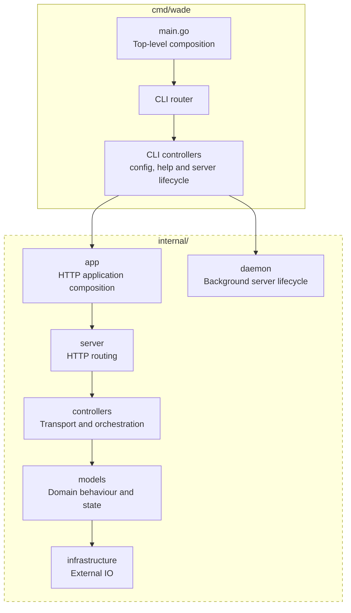

# Backend Architecture

## Overview

WADE's backend uses a direct MVC-style structure: `controllers -> models -> infrastructure`. HTTP and WebSocket controllers live in `internal/controllers`, aggregate Models live in `internal/models/<aggregate>`, and external IO implementations live in `internal/infrastructure/<capability>`. Application wiring is split between `cmd/wade/main.go`, the top-level composition root, and `internal/app`, which constructs the HTTP application.

Dependencies flow in one direction. Controllers handle transport concerns and coordinate Models, Models own domain behaviour, validation, state and concurrency, and infrastructure performs mechanical filesystem, environment, Git, provider and PTY operations. Infrastructure never depends on Models or controllers, Models never depend on controllers, and cross-aggregate workflows are composed at the controller layer rather than through Model-to-Model dependencies.

### Dependency Flow

## Aggregate Models

Each package under `internal/models` represents a domain aggregate and exposes one application-scoped, concurrency-safe `Model`. The Model is the authoritative boundary for its domain behaviour, validation, state and high-level workflows, returning detached value snapshots rather than exposing mutable internal state.

WADE has six aggregate Models:

- [`workspaces`](#workspaces)
- [`repositories`](#repositories)
- [`remoterepositories`](#remoterepositories)
- [`terminals`](#terminals)
- [`reviewsnapshots`](#reviewsnapshots)
- [`settings`](#settings)

Related concepts remain within their owning aggregate, such as worktrees and branches within `repositories`, rather than becoming separate Models or introducing Model-to-Model dependencies.

### Workspaces

The `workspaces` Model owns workspace discovery, identity, lookup, materialisation and provider links. It lists all or selected workspaces, loads individual workspaces and clones remote repositories into configured destinations.

It works with `filesystem` workspace discovery, along with `github` and `linear` clients. Workspace state is read fresh, while conflicting materialisations are serialised by workspace identity and target path.

Controllers add repository context and terminal activity to workspace responses. Provider-link enrichment is best-effort, so optional GitHub or Linear failures do not prevent workspace loading.

### Repositories

The `repositories` Model owns local repository identity, workspace Git contexts, worktrees, branches and remote mappings. It loads repositories, maps remotes, and lists or mutates worktrees and branches.

Repository data is loaded through the `filesystem` and `git` infrastructure packages. It is read fresh, worktree mutations are serialised per repository, and all returned resources are detached values.

Worktrees and branches remain part of the `repositories` aggregate. Controllers close a worktree's terminals before removal, but the Model remains authoritative and independently revalidates removability.

### RemoteRepositories

The `remoterepositories` Model provides a read-only view of repositories available from GitHub. It validates required provider fields, maps results into domain resources and returns them in a stable order.

It depends only on `github` infrastructure and loads provider state on each operation rather than retaining a repository cache.

Workspace materialisation belongs to `workspaces`. Controllers add local workspace IDs through one bulk `repositories` query.

### Terminals

The `terminals` Model owns PTY-backed terminal resources, processes, buffers, clients and lifecycle. It creates terminals idempotently, handles input and connections, reports workspace activity, applies configuration and releases runtime resources.

It uses `filesystem` workspace discovery and `pty` infrastructure. Its application-scoped process registry is concurrency-safe, so concurrent creation of the same terminal resolves to one PTY.

API operations return detached `Terminal` values. Controllers use explicit live `TerminalSession` handles and remain responsible for WebSocket transport and protocol orchestration.

### ReviewSnapshots

The `reviewsnapshots` Model owns point-in-time review snapshots, revision pinning, file identity and scoped content loading. It creates, retrieves and deletes snapshots and loads their file contents.

It uses the `filesystem`, `git` and `github` infrastructure packages, including the shared workspace-discovery capability. Snapshots remain in a concurrency-safe in-memory registry until deletion or server shutdown, and callers receive defensive copies.

Snapshot scopes use captured file identity and pinned revisions. The `current` scope intentionally reads the workspace's current filesystem contents instead.

### Settings

The `settings` Model owns persisted settings and their resolved runtime configuration. It ensures the settings file exists, loads startup configuration, persists updates and reloads out-of-band changes.

It uses the `filesystem` settings-file capability and `environment` infrastructure. Persistence mutations are serialised while defaults, validation, legacy keys, unknown keys, normalisation and environment precedence are preserved.

`settings` remains independent of other Models. The HTTP controller coordinates runtime reconfiguration, while the CLI and server startup share the same `settings` Model.

## Infrastructure Modules

Packages under `internal/infrastructure` provide concrete access to the operating system and external tools. They own mechanical IO, command execution, timeouts and external-format parsing, while Models retain domain validation, policy and multi-step workflows.

Each Model defines the infrastructure interfaces it consumes. Infrastructure packages return technical values and never depend on Models or controllers.

WADE has six infrastructure modules:

- [`environment`](#environment)
- [`filesystem`](#filesystem)
- [`git`](#git)
- [`github`](#github)
- [`linear`](#linear)
- [`pty`](#pty)

### Environment

The `environment` module reads process-level state needed during configuration and startup. It provides the current user's home directory, environment variables, the inherited shell and executable lookup through `PATH`.

The module is stateless and contains no configuration policy. The `settings` Model decides how environment values interact with persisted settings and defaults.

### Filesystem

The `filesystem` module provides general file and directory operations, settings-file access and workspace discovery. It creates directories, checks paths, reads and copies files, persists settings, and resolves workspace IDs to local directories.

Workspace discovery scans configured directories fresh, preserves directory precedence, skips duplicate IDs and canonical paths, and uses canonical paths for comparisons. Its configured directory list can be reloaded safely and is shared by the Models that need workspace locations.

The module owns mechanical filesystem behaviour rather than domain policy. Models decide which paths are valid, when files should be copied and how filesystem failures map to domain errors.

### Git

The `git` module runs bounded Git commands and parses their output into technical values. It supports repository and worktree identity, remotes, branches, worktree mutations, ignored paths, review diffs, revision resolution and content loading.

The client is stateless and receives the working directory and request context for each operation. Command failures and timeouts are returned to the consuming Model with the relevant technical output.

Models remain responsible for workflows such as branch selection, target-path construction, worktree removability and review-window construction. This keeps Git command syntax out of the domain layer without moving domain policy into infrastructure.

### GitHub

The `github` module integrates with GitHub through the `gh` CLI. It lists visible repositories, clones repositories, and resolves pull request URLs and metadata into provider-owned technical types.

Commands run with bounded contexts and provider output is parsed before being returned to Models. Consuming Models decide whether a provider failure is fatal, such as cloning failure, or best-effort, such as optional link enrichment.

### Linear

The `linear` module identifies Linear ticket keys embedded in branch names and builds issue references for the configured workspace. A branch without a ticket key returns no result rather than an error.

The module contains only provider-specific parsing and URL construction. The `workspaces` Model maps its technical ticket value into workspace link resources and decides how resolution failures affect enrichment.

### PTY

The `pty` module starts interactive shells and configured commands through operating-system pseudo-terminals. It sets terminal and WADE environment variables and exposes low-level process operations for reading, writing, resizing and closing.

It also resolves the configured shell or platform fallback, but does not own terminal resources, registries, buffering or WebSocket clients. Those lifecycle and concurrency concerns remain in the `terminals` Model.
