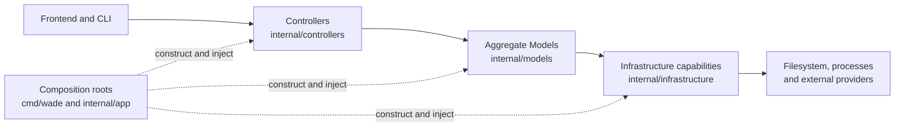

# Backend Architecture

## Overview

WADE's backend uses a direct MVC-style structure: `controllers -> models -> infrastructure`. HTTP and WebSocket controllers live in `internal/controllers`, aggregate Models live in `internal/models/<aggregate>`, and external IO implementations live in `internal/infrastructure/<capability>`. Application wiring is split between `cmd/wade/main.go`, the top-level composition root, and `internal/app`, which constructs the HTTP application.

Dependencies flow in one direction. Controllers handle transport concerns and coordinate Models, Models own domain behaviour, validation, state and concurrency, and infrastructure performs mechanical filesystem, environment, Git, provider and PTY operations. Infrastructure never depends on Models or controllers, Models never depend on controllers, and cross-aggregate workflows are composed at the controller layer rather than through Model-to-Model dependencies.

## Dependency Flow

